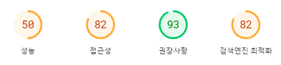
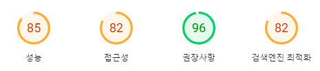
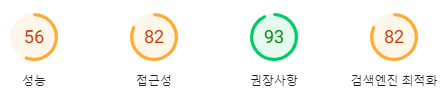
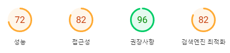
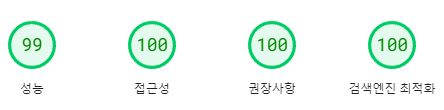
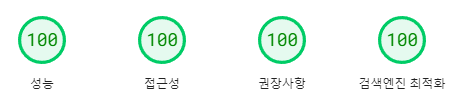

# Performance Practice

## 성능개선 이전 최초 측정 (/w Pagespeed Insights)

### 측정 1회차

### 측정 2회차

---

## 성능개선 이후 측정 (/w Pagespeed Insights)

### Mobile

### Desktop

## 성능개선 이후 측정 (/w GitHub Actions - lhci)

| key            | score  |
| -------------- | ------ |
| performance    | 🟢 100 |
| accessibility  | 🟢 100 |
| best-practices | 🟢 92  |
| seo            | 🟢 100 |

> best-practices의 경우 액션 러너 환경에서는 http로 실행되기에 점수가 낮게 나타남을 아티팩트에 업로드된 결과 디테일을 통해 확인할 수 있었음

---

### 개선 처리별 개선 결과

| commit                                                                                                       | result                                                                                                                                                                           |
| ------------------------------------------------------------------------------------------------------------ | -------------------------------------------------------------------------------------------------------------------------------------------------------------------------------- |
| [a897c3d](https://github.com/lucettin5/performance-practice/commit/a897c3db5b3fc44ead9942bd25c5b447621bb5ec) | 1. 이미지 로딩 속도 향상 및 네트워크 비용 감소                                                                                                                                   |
|                                                                                                              | 2. `<picture>` 태그 사용 및 WebP 형식 이미지 추가로 반응형 이미지 지원과 용량감소 등                                                                                             |
|                                                                                                              | 3. Performance 점수 MOBILE: 32 → 49 (+17), DESKTOP: 58 → 72 (+14) / LCP(Largest Contentful Paint) 개선 MOBILE: 13279ms → 3917ms, DESKTOP: 2853ms → 1275ms                        |
|                                                                                                              | 4. `picture` 태그 사용 방식을 조금 더 익히게 됨 / SharpJS를 통해 이미지를 WebP로 변환하고 메타데이터를 제거하는 등 처리를 경험                                                   |
| [1fac0ed](https://github.com/lucettin5/performance-practice/commit/1fac0ed3d633719ff9eb0900e69f2300bfac0907) | 1. 폰트 로딩 속도 개선 및 외부 의존성 감소                                                                                                                                       |
|                                                                                                              | 2. Google Fonts CDN에서 제공되던 폰트를 static WOFF2 파일로 변경하여 서버에서 직접 제공                                                                                          |
|                                                                                                              | 3. 측정 점수 변화는 없었음                                                                                                                                                       |
|                                                                                                              | 4. 웹폰트 로딩과 달리 asset으로 폰트를 더하면 FOUT: Flash of Unstyled Text 또는 FOIT: Flash of Invisible Text의 감소를 기대할 수 있음                                            |
| [a3bf731](https://github.com/lucettin5/performance-practice/commit/a3bf7314cc8a4e2555272ed2b9762f29b6ad68fc) | 1. 모바일 hero 이미지 최적화 및 레이아웃 안정성 향상                                                                                                                             |
|                                                                                                              | 2. 모바일용 hero 이미지 preload 및 hero 이미지에 aspect-ratio 지정                                                                                                               |
|                                                                                                              | 3. Performance 점수 MOBILE: 38 → 71 (+33), DESKTOP: 70 → 89 / CLS(Cumulative Layout Shift) 대폭 개선 MOBILE: 0.49 → 0.009, DESKTOP: 0.42 → 0.013 (+19)                           |
|                                                                                                              | 4. image preload를 통한 성능개선 효과를 확인할 수 있었으며, aspect-ratio 를 적절하게 지정하면 브라우저가 사전에 레이아웃을 잡는 것에 도움이 됨을 확인                            |
| [a408f7b](https://github.com/lucettin5/performance-practice/commit/a408f7bfe24aee4b9040bc3a86a97cf47dd834bd) | 1. 쿠키 동의 스크립트 로딩 성능 개선                                                                                                                                             |
|                                                                                                              | 2. 스크립트 로딩을 비동기적으로 변경하고, DOMContentLoaded 이벤트 이후 실행하도록 수정                                                                                           |
|                                                                                                              | 3. Accessibility 점수 MOBILE: 82 → 89 (+7)                                                                                                                                       |
|                                                                                                              | 4. 쿠키 동의는 로딩과 동시에 나타나야할 필요는 없으나 지역별 법에 따라 빠르게 나타나야할 수 있으니 이는 주의를 요하는 수정이 될 것                                               |
| [6a1ec9d](https://github.com/lucettin5/performance-practice/commit/6a1ec9d3e78a0069d1fee7f9a4b1cbf5b8e35e7c) | 1. 메뉴 아이콘 접근성 개선                                                                                                                                                       |
|                                                                                                              | 2. 메뉴 아이콘 이미지에 alt 속성 추가                                                                                                                                            |
|                                                                                                              | 3. Accessibility 점수 MOBILE: 89 → 95 (+6), DESKTOP: 91 → 95 (+4)                                                                                                                |
|                                                                                                              | 4. 단순한 아이콘이더라도 image라면 alt 속성을 반드시 부여할 것                                                                                                                   |
| [d2e5d0e](https://github.com/lucettin5/performance-practice/commit/d2e5d0e939820a28a26b4f19b48157c8cdf808d5) | 1. 상품 이미지 로딩 최적화                                                                                                                                                       |
|                                                                                                              | 2. 상품 이미지에 lazy 로딩 및 object-fit 적용                                                                                                                                    |
|                                                                                                              | 3. Performance 점수 MOBILE: 74 → 100 (+26), DESKTOP: 89 → 100 (+11) / TBT(Total Blocking Time) 대폭 감소 MOBILE: 1567ms → 20ms, DESKTOP: 198ms → 0ms                             |
|                                                                                                              | 4. `IntersectionObserver`를 이용한 스크롤에 따른 로딩 적용을 시도해보았으나, 스켈레톤 이미지에서 실제 이미지로 바뀌는 걸 보여주는 것이 오히려 좋지 않다고 판단하여 추가하지 않음 |
| [2be2a81](https://github.com/lucettin5/performance-practice/commit/2be2a8164d5f8c9d8921729fabfc53df25b329ca) | 1. SEO 최적화                                                                                                                                                                    |
|                                                                                                              | 2. meta 태그 추가 (title, description, keywords, og:title, og:description, og:image)                                                                                             |
|                                                                                                              | 3. 점수 변화 없음                                                                                                                                                                |
|                                                                                                              | 4. 단일 페이지 앱이어서 sitemap 등은 필요하지 않겠으나, SEO 최적화를 위해서는 추가적인 학습을 통해 다양한 적용을 알아야 할 필요 존재                                             |
| [e0abd4f](https://github.com/lucettin5/performance-practice/commit/e0abd4f9847dcc6301173751f8bf24cbaf4c6803) | 1. 웹 접근성 및 SEO 개선                                                                                                                                                         |
|                                                                                                              | 2. 제목 태그 레벨 조정 (h1, h2, h3, h4, h5 적절히 사용)                                                                                                                          |
|                                                                                                              | 3. SEO 점수 MOBILE: 91 → 100 (+9), DESKTOP: 91 → 100 (+9)                                                                                                                        |
|                                                                                                              | 4. heading 태그의 순서가 SEO에 미치는 영향 또한 중요함을 알게 됨                                                                                                                 |
| [b9762b4](https://github.com/lucettin5/performance-practice/commit/b9762b4440129b8284d27d9fa08f3da2b8a2ccd5) | 1. 모바일용 hero 이미지 최적화                                                                                                                                                   |
|                                                                                                              | 2. 모바일용 hero 이미지 크기 조정                                                                                                                                                |
|                                                                                                              | 3. Performance 점수 뱐화 없는 편                                                                                                                                                 |
|                                                                                                              | 4. 미미한 성능 변화, 측정 반복 시 조금은 점수가 오르기도 함                                                                                                                      |
| [515cac2](https://github.com/lucettin5/performance-practice/commit/515cac29baa33cbd5faee68443b2f1fe721caf79) | 1. 색상 대비 개선으로 접근성 향상                                                                                                                                                |
|                                                                                                              | 2. 주요 색상 값 조정 (#33c6dd → #3360dd, #9b9b9b → #696969)                                                                                                                      |
|                                                                                                              | 3. Accessibility 점수 DESKTOP: 95 → 100 (+5)                                                                                                                                     |
|                                                                                                              | 4. 디자인의 변화가 존재하므로 실제 작업이라면 해당 팀과 논의가 필요함, color-contrast가 접근성에 영향을 미친다는 점을 알게 됨                                                    |
| [6f3a972](https://github.com/lucettin5/performance-practice/commit/6f3a97213a27a8290b4d48ba9d42e335b707aa3c) | 1. image 비율 사전 지정을 통한 레이아웃 최적화                                                                                                                                   |
|                                                                                                              | 2. aspect-ratio의 지정이 아닌 img 태그의 width, height를 1, 1로 주어 브라우저에 의한 빠른 계산에 도움                                                                            |
|                                                                                                              | 3. 점수의 변화는 크게 없었으나, 주황색으로 알림을 주던 image에 적합한 width, height 값이 없습니다가 나타나지 않게 됨                                                             |
|                                                                                                              | 4. CSS aspect-ratio와는 다르지만 유사한 img태그의 width, height를 통한 비율 부여를 알게 됨                                                                                       |
